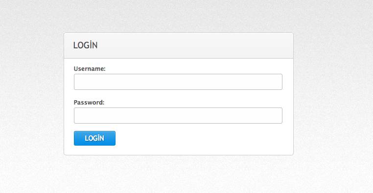
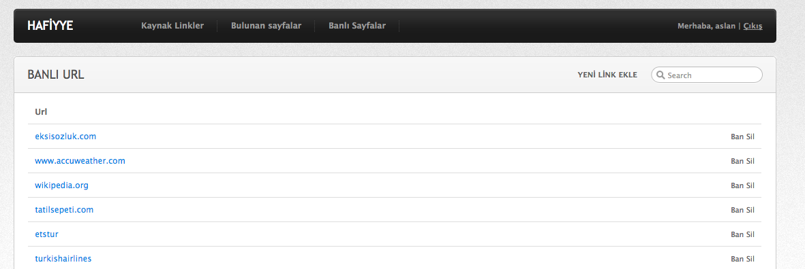
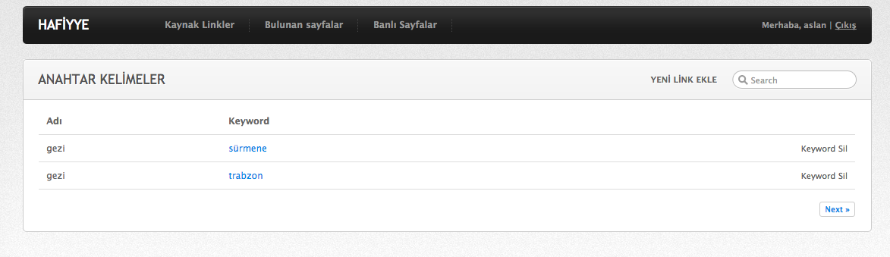

# Hafiyye

## Getting Started

İnternette sizin belirttiğiniz keywordler ile periyodik arama yaparak size ilgili sonuçları listeler [Go language](http://www.golang.org/).

### Paketler:

    Revel Framework
    MongoDB

    go get github.com/revel/revel
    go get gopkg.in/mgo.v2
    go get github.com/PuerkitoBio/goquery
    go get github.com/janekolszak/revmgo

### Start the web server:

    revel run hafiyye

   Run with <tt>--help</tt> for options.

### Go to http://localhost:9000/ and you'll see:

"It works"

### Description of Contents

The default directory structure of a generated Revel application:

    myapp               App root
      app               App sources
        controllers     App controllers
          init.go       Interceptor registration
        models          App domain models
        routes          Reverse routes (generated code)
        views           Templates
      tests             Test suites
      conf              Configuration files
        app.conf        Main configuration file
        routes          Routes definition
      messages          Message files
      public            Public assets
        css             CSS files
        js              Javascript files
        images          Image files

